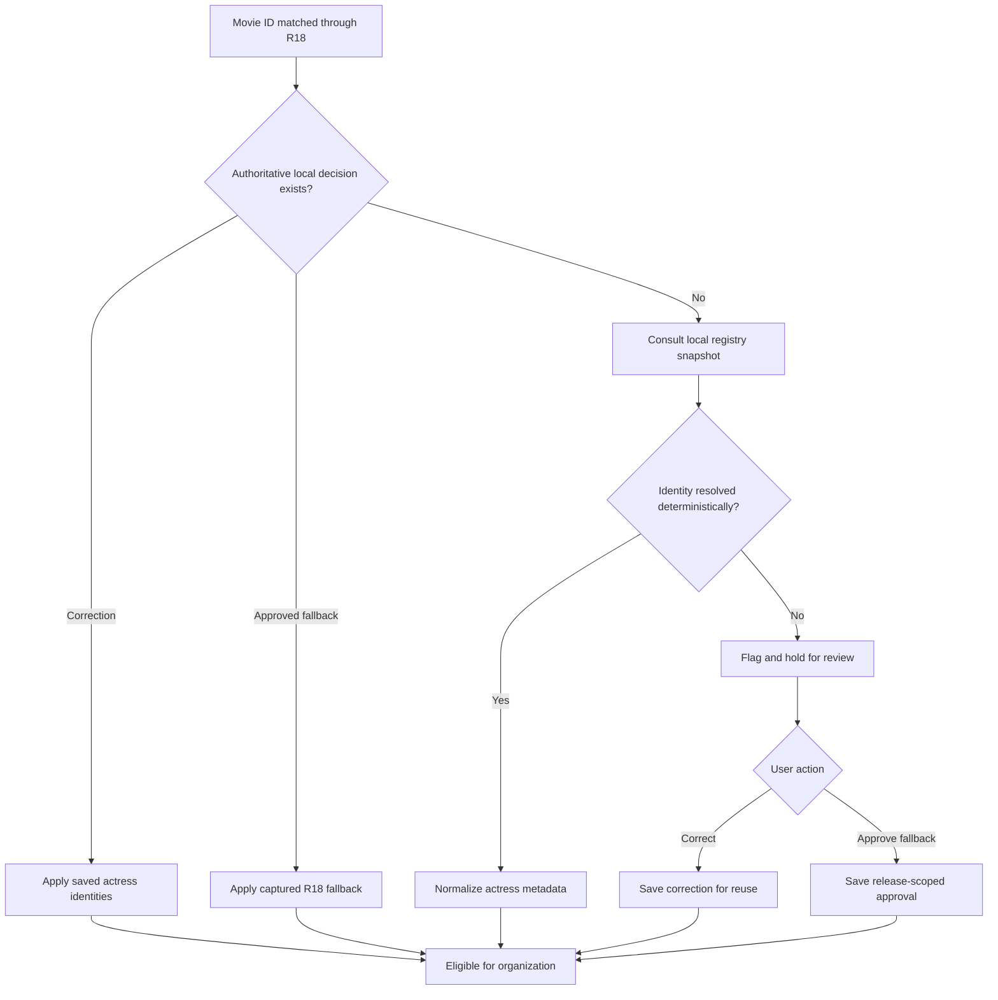
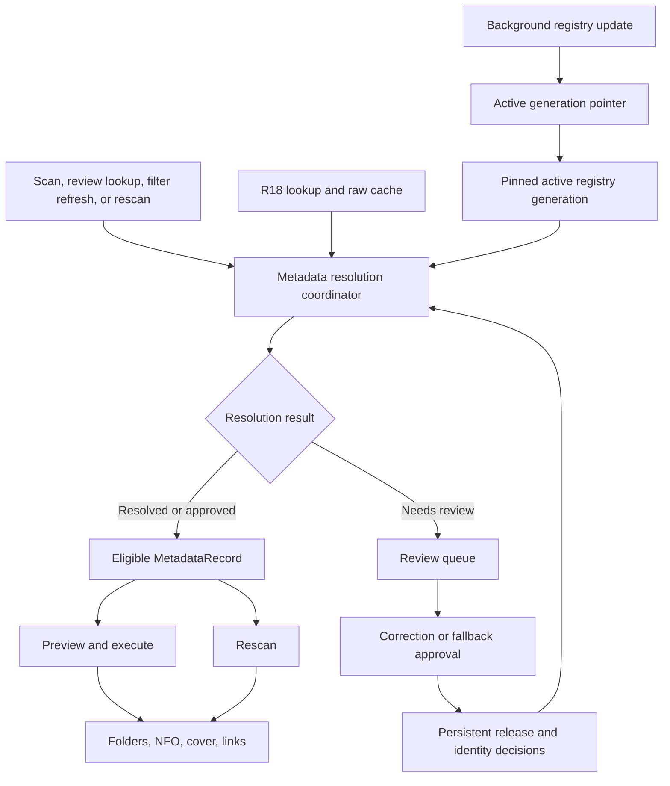
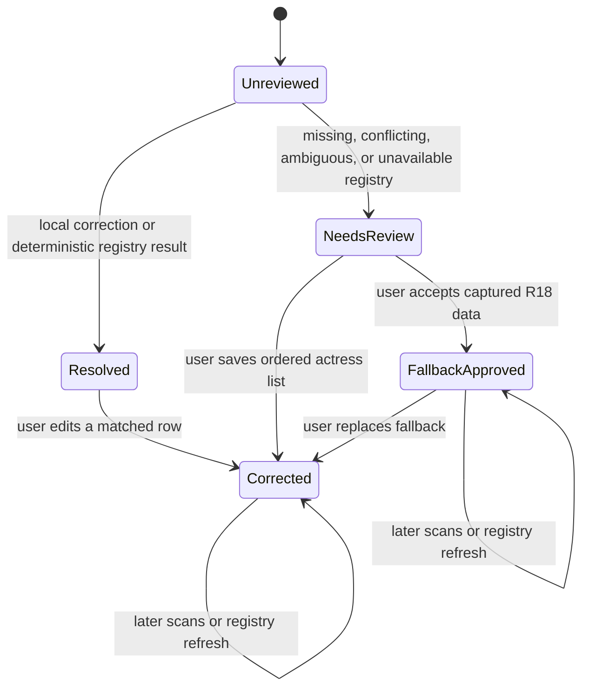

# Actress Identity Correction - Plan

## Goal Capsule

- **Objective:** Actress folders and generated metadata use consistent, resolved identities, while movies with unresolved actresses cannot be organized without the user's approval.
- **Means:** Add a versioned local actress registry, a persistent decision store, and a shared resolver around the existing R18 movie lookup (KTD1-KTD4).
- **Product authority:** R18 remains the movie metadata source. Actress identity accuracy takes priority over broader cross-source enrichment, and the feature must not require a paid service or dependable access through JavLibrary's Cloudflare challenge.
- **Execution profile:** Implement the persistence and resolver contracts before integrating workers, review UI, and output paths. Keep network-dependent checks optional.
- **Stop conditions:** Stop after U2 if the selected R18.dev dump cannot map a canonical content ID to ordered actress identities, cannot recover at least one representative title with known inaccurate or missing R18 API cast data, or no longer permits local use.
- **Tail ownership:** The implementing agent owns code, offline fixtures, regression tests, README updates, and packaging verification. Live registry validation remains a user-triggered check.

---

## Product Contract

### Summary

Add an actress identity correction stage around the existing R18 lookup. Use a versioned local R18.dev snapshot for deterministic recovery, preserve local decisions separately from fetched metadata, and route uncertain results into review before organization.

### Problem Frame

R18 sometimes omits actresses or returns names that differ from JavLibrary's registry. Missing actresses create `Unknown` folders, while inconsistent names split one actress across multiple folders. The current workaround is to look up the movie ID in JavLibrary, create or repair the folder manually, and move the video, NFO, and cover image together.

The application currently has one automatic metadata source, keeps successful and not-found cache entries without a refresh policy, and lets unresolved rows correct only their content ID. Already matched rows cannot use that review dialog, so a plausible but inaccurate R18 match passes into organization without a correction point.

### Key Decisions

- **Build an actress identity correction layer.** (session-settled: user-approved — chosen over a direct JavLibrary scraper: a lightly used local tool does not justify recurring Cloudflare maintenance.) Governs R1-R4.
- **Keep R18 as the movie metadata source.** (session-settled: user-approved — chosen over full-record JavLibrary replacement: the proven failures concern actress identity and its effect on folders.) Governs R1, R2, R11.
- **Require review before unresolved items can run.** (session-settled: user-directed — chosen over processing a warned R18 fallback: doing so could create the same incorrect folder the feature is meant to prevent.) Governs R5-R10.
- **Keep the feature free to operate.** (session-settled: user-directed — chosen over a brokered JavLibrary API: the project will be used too little to justify ongoing spend.) Governs R2, R11.

### Requirements

**Identity resolution**

- R1. Every R18-matched movie must pass through actress identity resolution before it becomes eligible for organization.
- R2. Resolution must consult a no-cost secondary actress registry when no authoritative local correction exists.
- R3. Resolution must fill missing actress lists and normalize known incorrect name variants when the secondary registry or local corrections provide a confident answer.
- R4. Resolution must not merge distinct actresses solely because their names are similar; ambiguous identities remain unresolved.

**Local corrections and reuse**

- R5. A user correction must persist locally and take precedence over fetched actress data on later scans.
- R6. A saved correction must apply automatically to every movie that can be confidently associated with the same actress identity or known name variant.
- R7. Refreshing fetched metadata must not overwrite a user correction without review.

**Review and processing safety**

- R8. A movie with missing or ambiguous actresses after resolution must be visibly marked for review with the reason it could not be resolved.
- R9. A flagged movie must be excluded from processing until the user corrects it or explicitly approves the fallback metadata.
- R10. Review must be available for already matched rows and must allow the actress list to be edited in addition to the content ID.

**Source and scope constraints**

- R11. Normal operation must not require a paid metadata service, a paid API key, or successful automation of a Cloudflare challenge.

### Resolution Flow



### Key Flows

- F1. Automatic identity resolution
  - **Trigger:** An R18 metadata match is returned for a scanned movie.
  - **Steps:** Apply an authoritative local decision when available; otherwise consult the secondary registry and accept only a deterministic identity result.
  - **Outcome:** The movie is eligible for organization with normalized actresses, or it enters review.
  - **Covered by:** R1-R8.
- F2. Resolve a held movie
  - **Trigger:** The user opens a movie flagged for missing, conflicting, or ambiguous actresses.
  - **Steps:** Review the reason and source details, edit the actress list or approve the R18 fallback, and save the decision.
  - **Outcome:** The movie becomes eligible for organization and the decision is available to later scans.
  - **Covered by:** R5-R10.
- F3. Reuse a correction
  - **Trigger:** A later scan encounters a content ID or recognized identity covered by a saved correction.
  - **Steps:** Apply the local correction before consulting the secondary registry.
  - **Outcome:** Related movies use the same actress name without repeated manual work.
  - **Covered by:** R5-R7.

### Acceptance Examples

- AE1. Missing actress recovered
  - **Covers:** R1-R3.
  - **Given:** R18 returns no actresses and the local registry has a deterministic movie-to-actress match.
  - **When:** Identity resolution runs.
  - **Then:** The recovered actress appears in the NFO and determines the actress folder instead of `Unknown`.
- AE2. Incorrect variant normalized
  - **Covers:** R3, R5, R6.
  - **Given:** R18 returns a known incorrect name variant covered by a saved correction.
  - **When:** The movie is scanned.
  - **Then:** The canonical saved name is applied without review or another registry lookup.
- AE3. Ambiguous identity held safely
  - **Covers:** R4, R8, R9.
  - **Given:** The available sources cannot distinguish between multiple actress identities.
  - **When:** Resolution completes.
  - **Then:** The movie is flagged with the ambiguity reason and excluded from processing.
- AE4. Correction becomes reusable
  - **Covers:** R5-R7, R10.
  - **Given:** The user edits the actress list on an already matched movie.
  - **When:** A later movie contains the same recognized identity or known variant.
  - **Then:** The saved correction is applied automatically and is not replaced by fetched metadata.
- AE5. Explicit fallback approval
  - **Covers:** R8-R10.
  - **Given:** The registry is unavailable or inconclusive and R18 metadata remains unverified.
  - **When:** The user explicitly approves that fallback in review.
  - **Then:** That release remains eligible on later scans with visible `r18_fallback` provenance, without becoming a reusable identity correction.

### Success Criteria

- Movies with recoverable actress data no longer enter `Unknown` or inconsistent actress folders.
- No unresolved actress result is processed unless the user explicitly approves the fallback.
- Correcting a known actress once removes repeated cleanup for later movies associated with that identity.
- Existing content-ID correction remains available while already matched rows gain an actress correction path.
- A later rescan preserves authoritative corrections and approved fallbacks.

### Scope Boundaries

- Do not scrape JavLibrary directly or depend on bypassing its Cloudflare challenge.
- Do not require a paid metadata broker or subscription.
- Do not reconcile title, studio, genres, release date, cover art, or other non-actress fields across sources.
- Do not replace R18 as the baseline movie metadata source.
- Do not add fuzzy name matching as an automatic authority.
- Do not automatically relocate videos that were already organized into tag folders; corrected identities apply to future organization, NFO regeneration, and existing rescan-supported link updates.

### Dependencies and Assumptions

- R18.dev continues publishing a downloadable structured-data snapshot under terms that permit local use.
- The snapshot exposes a deterministic content-ID relationship and stable actress identifiers or aliases. U2 must validate this against a committed schema fixture before the resolver depends on it.
- Some identities will still require a manual correction when the baseline and snapshot cannot resolve them confidently.
- The existing base-ID rule remains valid for actress identity: `ABC-123-C` shares the cast decision for `ABC-123` while retaining its exact release ID in output filenames.

### Sources and Research

- `javsorter/scraping/lookup.py` and `javsorter/scraping/r18.py` establish R18 as the current automatic metadata path.
- `javsorter/scraping/cache.py` stores fetched timestamps but does not expire or refresh successful or not-found entries.
- `javsorter/scraping/parser.py` handles missing R18 fields defensively without cross-source reconciliation or metadata confidence.
- `javsorter/gui/widgets/match_review_dialog.py` supports content-ID correction but no metadata-field editing.
- `javsorter/gui/main_window.py` opens review only for rows that are not already matched.
- `javsorter/organize/options.py`, `javsorter/organize/category_builder.py`, `javsorter/organize/nfo_writer.py`, and `javsorter/organize/rescan.py` consume the resolved actress list downstream.
- [R18.dev database dumps](https://r18.dev/dumps) documents weekly gzipped SQL snapshots, a stable latest-download URL, retention limits, and CC0 structured data.
- [R18.dev actress pages](https://r18.dev/) demonstrate stable actress entities with aliases that can support canonical-name normalization.
- [Cloudflare supported browsers](https://developers.cloudflare.com/cloudflare-challenges/reference/supported-browsers/) documents automated browser frameworks as unsupported for production challenges.
- [JAV.bundle source design](https://github.com/Xavier-Lam/JAV.bundle) demonstrates separate actress-name correction data alongside prioritized movie metadata sources.

---

## Planning Contract

Product Contract unchanged: the planning additions select the free registry, persistence boundary, resolution contract, and integration sequence without broadening metadata scope.

### Key Technical Decisions

- KTD1. **Use a versioned local R18.dev snapshot as the secondary registry, subject to an effectiveness gate.** U2 must prove both the dump schema and recovery of a representative known API failure before later units depend on it. Import only the movie-to-actress and actress-alias data needed by R2-R4 into a compact local index. (session-settled: user-approved — chosen over a live third-party request per movie: the snapshot avoids a recurring runtime dependency while remaining free.)
- KTD2. **Persist identity decisions outside the raw R18 metadata cache.** Store release decisions and identity alias overrides in a dedicated SQLite-backed store under the existing application-data root. Every save, replacement, deletion, and schema migration is transactional. A corrupt or unreadable authoritative store enters a visible fail-closed state instead of continuing as an empty store. (session-settled: user-approved — chosen over rewriting cached R18 records: fetched data and user intent need different lifecycles.)
- KTD3. **Resolve identity through Qt-free domain types and one application coordinator.** Core types represent decisions, registry evidence, provenance, candidates, and `resolved`, `needs_review`, or `fallback_approved` results. A coordinator composes scraping adapters and the pure resolver; workers and UI consume its result while organizers receive only eligible `MetadataRecord` values.
- KTD4. **Use deterministic precedence and conflict handling.** Apply a manual correction first, then a persisted release fallback, then an exact registry content-ID result. A conflicting, absent, corrupt, or multiply matched registry result requires review and never silently merges names. (session-settled: user-approved — chosen over automatically trusting every registry disagreement: uncertain identities must remain held under R3, R4, R8, and R9.)
- KTD5. **Separate release decisions from identity alias overrides.** Corrections and fallback approvals use the canonical base release ID. Cross-release reuse under R6 requires a stable registry actress ID or a user-confirmed binding; a typed name without identity evidence remains release-scoped, and normalized name similarity alone is insufficient.
- KTD6. **Activate immutable snapshot generations through a small active-version pointer.** A dedicated background update path streams into a revision-scoped candidate, validates and reopens it, then switches the active pointer. Each lookup pins one generation. Existing readers finish on the old file, and failed or concurrent refreshes leave the last valid generation active. Publisher checksums are used only when available; otherwise provenance records a local digest plus transport, archive, schema, and referential validation.
- KTD7. **Use one transformation order at every entry point.** The coordinator performs canonical base-ID R18 lookup and cache read, local-decision and registry resolution, actress overlay, genre filtering, and exact release-ID restoration in that order. Initial scan, content-ID review lookup, genre-blocklist reapplication, execution eligibility, and rescan all use this path.

### High-Level Technical Design

These sketches define boundaries and state transitions. They are directional rather than exact class or schema designs.

#### Component and data flow



#### Identity decision state machine



#### Snapshot lifecycle

```mermaid
sequenceDiagram
  participant U as Registry update worker
  participant M as Registry manager
  participant R as R18.dev dump endpoint
  participant P as Active generation pointer
  participant G as Immutable index generations
  U->>M: Start or refresh registry
  M->>R: Stream latest archive to revision staging
  R-->>M: Compressed SQL snapshot
  M->>M: Import, digest, validate, and reopen candidate
  alt Candidate valid
    M->>G: Publish immutable generation
    M->>P: Switch active revision
    M-->>U: Activation complete; held rows may re-resolve
  else Download or validation fails
    M-->>U: Keep prior generation or report unavailable
  end
```

### System-Wide Impact

- **Persistent state:** Raw R18 cache entries, authoritative identity decisions, and replaceable registry generations have separate lifecycles. Decision-store corruption preserves the damaged file and blocks affected resolution; it never creates a silently authoritative empty store.
- **Transactions and migrations:** A decision write becomes visible only after its complete transaction commits. Versioned schema migration failures roll back to the prior readable schema and leave UI eligibility unchanged.
- **Concurrency:** Match and rescan readers pin one immutable registry generation. One serialized update writer publishes a candidate and switches the active pointer; old generations remain until their readers close.
- **Failure propagation:** Decision-store read or write failure is a distinct fail-closed resolution error. Network, snapshot, and schema failures become review reasons or update errors, never fallback approval or generic R18 `NO_MATCH`.
- **Eligibility:** `_matched_records` remains the execution boundary. It must contain only resolver-approved records and must update immediately after review changes.
- **Output consistency:** The corrected ordered actress list must drive actress tag folders, category links, NFO actors, preview text, and rescan results from one effective `MetadataRecord`.
- **Lifecycle ownership:** `MainWindow` owns and closes the client, raw cache, identity store, and registry manager after workers stop. A failed correction commit cannot update the row or `_matched_records` before a successful reread.
- **Compatibility:** Existing cache databases, settings, ID correction, genre filtering, multi-part grouping, and `-C` filename behavior continue to work without user migration steps.

### Risks and Dependencies

- **Source independence:** The dump and API reflect the same upstream dataset, so schema access does not prove better accuracy. U2 gates the rest of the implementation on a known bad or missing-cast title that the dump can repair.
- **Snapshot size and import cost:** The R18.dev archive is large for an occasional local tool. Use a dedicated streaming downloader with progress and cancellation, preflight disk space where practical, and delete only revision-scoped incomplete staging artifacts.
- **Snapshot schema drift:** Pin import logic to a fixture derived from a known snapshot. Reject unknown required-column changes and preserve the prior usable index.
- **Coverage limits:** A local snapshot can normalize aliases only when its relationships contain the needed evidence. Hold unresolved rows and preserve manual correction as the escape hatch.
- **Identity collisions:** Romanized names and aliases are not globally unique. Require stable registry IDs or explicit user mappings before cross-release reuse.
- **Stale approvals:** A newer snapshot must not silently reopen or replace a correction or approved fallback. Surface newer evidence only as an optional future review opportunity.
- **Disk and crash recovery:** Candidate databases and compressed archives can consume substantial space. Lifecycle markers distinguish incomplete staging artifacts from active and known-good generations so startup cleanup cannot remove usable data.
- **UI responsiveness:** Acquisition and import cannot run on the GUI thread. Cancellation must leave either the previous valid snapshot or no snapshot, never a partially active one.
- **Authoritative-store failure:** A lock, failed migration, failed commit, or corrupt decision database can hide user intent. Keep rows out of execution until the store is readable and the durable decision has been reread.

### Sequencing

1. U2 proves the selected dump can recover a representative known R18 API failure, then establishes the versioned registry index and offline fixtures.
2. U1 establishes persisted decisions, identity bindings, transactions, and fail-closed recovery semantics.
3. U3 composes raw R18 metadata, U1 decisions, and U2 registry evidence into one resolution contract and order.
4. U4 exposes resolution and review state in the worker and GUI paths.
5. U5 applies the shared resolver to output and rescan behavior, then closes documentation and packaging verification.

---

## Implementation Units

### U1. Identity decision model and persistent store

- **Goal:** Persist corrections and fallback approvals independently from fetched R18 metadata.
- **Requirements:** R5-R7, R9; F2, F3; AE2, AE4, AE5; KTD2, KTD5.
- **Dependencies:** U2. Do not begin this unit unless the registry source passes the U2 effectiveness gate.
- **Files:** `javsorter/core/models.py`, `javsorter/core/actress_identity.py` (new), `javsorter/config/paths.py`, `javsorter/scraping/identity_store.py` (new), `tests/test_identity_store.py` (new), `tests/test_cache.py`.
- **Approach:** Add adapter-free decision and provenance types plus a SQLite-backed store in the existing application-data location. Separate canonical base-release decisions from stable-registry-ID alias overrides. Distinguish no decision, an ordered correction, and a release-scoped R18 fallback approval. Follow `MetadataCache` for locking and context management, but add transactional writes, versioned migrations, uniqueness constraints, and an authoritative-store unavailable state instead of disposable-cache self-healing.
- **Execution note:** Characterize the existing cache recovery and base-ID behavior first, then add the new store tests before integrating it elsewhere.
- **Technical design:** Store the stable source ID, canonical display name, aliases or binding evidence, and source revision with a user decision so later snapshot changes cannot invalidate it. Update in-memory eligibility only after a complete transaction commits and the store can reread the decision. Treat an approved empty R18 list as an explicit fallback decision rather than a resolved correction.
- **Test scenarios:**
  - Save a correction for `ABC-123`, reopen the store, and expect the same ordered actress list and `manual_correction` provenance.
  - Save an R18 fallback approval, restart, and expect it to remain release-scoped and distinguishable from a reusable correction.
  - Save a correction for `ABC-123`, resolve `ABC-123-C`, and expect the base-release decision to apply while the exact output ID remains unchanged.
  - Save an explicit empty fallback, and expect it to differ from no decision and remain eligible only because approval is recorded.
  - Corrupt the decision database, and expect the damaged file to be preserved for recovery, the decision store to become visibly unavailable, and the raw metadata cache and registry index to remain unchanged.
  - Reopen with an unreadable decision store and no known-good recovery, and expect a visible unavailable state that prevents affected rows from becoming eligible.
  - Inject a failure during correction replacement or schema migration, then reopen and expect the previous complete decision with no partial alias or fallback rows.
  - Refresh to a snapshot that removes or renames a saved identity, and expect the durable correction to resolve unchanged from its stored evidence.
  - Replace a fallback with a manual correction, and expect only the correction to remain authoritative.
- **Verification:** Targeted persistence tests pass across store reopen, corrupt storage, base-ID reuse, empty approval, and decision replacement.

### U2. Versioned local registry acquisition and index

- **Goal:** Provide a free, deterministic, locally queryable actress registry without adding a per-title runtime service dependency.
- **Requirements:** R2-R4, R11; F1; AE1, AE3; KTD1, KTD5, KTD6.
- **Dependencies:** None. This is the feasibility gate for U1 and later units.
- **Files:** `javsorter/config/paths.py`, `javsorter/scraping/client.py`, `javsorter/scraping/actress_registry.py` (new), `javsorter/scraping/registry_download.py` (new), `tests/fixtures/registry/` (new), `tests/test_actress_registry.py` (new), `tests/test_live_registry.py` (new), `pyproject.toml`.
- **Approach:** First extract a reduced real-schema fixture and compare a representative title whose API actress data is known to be missing or inaccurate. Continue only if the dump supplies corrective evidence. Then add revisioned staging and immutable index paths, a cancellation-aware streaming downloader, the compact importer, provenance metadata, validation, and active-generation pointer. Keep all default tests on committed minimal fixtures.
- **Execution note:** Run the effectiveness checkpoint before persistence or GUI work. The optional live diagnostic verifies the dump endpoint and current schema; it does not belong to the offline suite.
- **Technical design:** The index returns exact match, no entry, or ambiguous candidates and never writes user decisions. Each lookup pins one immutable generation. The update manager serializes writers, computes a local digest, validates and reopens the candidate, switches the pointer, and retains the previous generation until readers release it.
- **Test scenarios:**
  - Import a fixture with one movie and multiple ordered actresses, then expect an exact lookup with stable identities, canonical names, aliases, and snapshot revision.
  - Import duplicate normalized content IDs that point to different identity sets, then expect an ambiguous result rather than an arbitrary winner.
  - Import aliases that differ only by case or whitespace for the same stable identity, then expect one normalized identity without false ambiguity.
  - Attempt an incompatible or malformed candidate, then expect the prior active snapshot to remain queryable.
  - Interrupt or fail a streamed download, then expect candidate cleanup and no partial activation.
  - Start without a snapshot and with no network, then expect an unavailable result that the resolver can route to review.
  - Hold a lookup open while activating a new generation, and expect that lookup to finish entirely on the old generation while later lookups use the new one.
  - Crash or exhaust disk space during download, import, validation, and pointer switching, then restart and expect one complete active generation plus cleanup limited to marked incomplete staging data.
  - Fetch a truncated archive, invalid content type, incompatible redirect, or duplicate revision with a different digest, and expect rejection with the prior generation preserved.
- **Verification:** Fixture-based import, lookup, schema rejection, atomic activation, cancellation, and prior-snapshot retention tests pass without network access.

### U3. Shared actress identity resolver

- **Goal:** Produce one effective metadata record and an explicit eligibility decision for every R18 match.
- **Requirements:** R1-R9; F1-F3; AE1-AE5; KTD3-KTD5, KTD7.
- **Dependencies:** U1 and U2.
- **Files:** `javsorter/core/models.py`, `javsorter/core/actress_identity.py`, `javsorter/scraping/identity_lookup.py` (new), `javsorter/scraping/lookup.py`, `tests/test_actress_identity.py` (new), `tests/test_lookup.py`, `tests/test_parser.py`.
- **Approach:** Extend the pure resolver to accept the raw `MetadataRecord`, canonical base ID, decision-store result, and registry evidence. Add an application coordinator that runs the KTD7 order and returns a typed resolution containing the effective record, decision state, provenance, review reason, stable-identity candidates, and source revision. Keep raw cache records unfiltered and unmodified.
- **Execution note:** Implement state-transition tests first because eligibility and precedence are the safety boundary for later GUI work.
- **Technical design:** Manual correction wins over all fetched data. A persisted fallback preserves its captured R18 list. An exact registry match can repair or normalize R18 data. Any registry conflict that lacks a deterministic content-ID identity set, any ambiguity, and any unavailable source with unverified R18 data returns `needs_review`.
- **Test scenarios:**
  - Resolve a missing R18 actress list against one exact registry entry, and expect `resolved` with the registry list and revision provenance.
  - Resolve an incorrect R18 alias against an explicit stable-identity mapping, and expect the saved canonical name.
  - Resolve conflicting R18 and registry lists with deterministic registry content-ID evidence, and expect the registry result; repeat without deterministic evidence and expect `needs_review`.
  - Resolve zero or multiple registry candidates, and expect a reasoned `needs_review` result without name-similarity merging.
  - Resolve with a saved correction after changing or deleting the R18 cache entry, and expect the correction to win.
  - Resolve with a saved fallback after a registry refresh, and expect the fallback to remain eligible until the user replaces it.
  - Apply genre filtering and the `-C` base lookup path, and expect existing non-actress behavior and exact output content IDs to remain unchanged.
  - Reapply the genre blocklist after a correction or fallback approval, and expect the actress decision and provenance to remain unchanged.
- **Verification:** Resolver and lookup tests prove all precedence branches, review reasons, base-ID behavior, cache separation, and unchanged genre-filter semantics.

### U4. Match worker, review UI, and run eligibility

- **Goal:** Make review-required identity state visible and editable while preventing held rows from reaching execution.
- **Requirements:** R1, R4, R8-R10; F1, F2; AE3-AE5; KTD3, KTD4, KTD7.
- **Dependencies:** U3.
- **Files:** `javsorter/core/models.py`, `javsorter/gui/workers.py`, `javsorter/gui/main_window.py`, `javsorter/gui/scan_table.py`, `javsorter/gui/widgets/match_review_dialog.py`, `tests/test_workers.py`, `tests/test_match_review_dialog.py`, `tests/test_scan_table.py` (new), `tests/test_gui_smoke.py`.
- **Approach:** Let `MainWindow` own and inject the coordinator, identity store, registry manager, and a dedicated registry-update worker. Keep filename/ID match status separate from a typed resolution field on each `ScanItem`. Show effective actresses, provenance, and review reason in the scan table. Permit review for matched and held rows. Preserve stable identity candidates so the user can bind a name correction across releases or leave a typed correction release-scoped. Rebuild `_matched_records` only after a durable decision commit and resolver reread.
- **Execution note:** Preserve cancellation and `finished` signal behavior while adding identity-specific signals or result payloads.
- **Technical design:** Saving a correction atomically replaces the full ordered list and updates the row immediately. Cancelling changes nothing. Blank and duplicate entries are normalized or rejected consistently. Fallback approval applies only to the canonical release and is never inferred from a network error.
- **Test scenarios:**
  - Match a batch containing resolved, ambiguous, fallback-approved, and network-error rows, then expect only resolved and approved rows in the execution set.
  - Double-click a matched row, edit its ordered actresses, save, and expect table metadata, provenance, and execution data to update immediately.
  - Cancel an edit and reopen the row, and expect the original decision and display to remain unchanged.
  - Approve an R18 fallback, restart the scan flow, and expect the release to remain eligible with visible fallback provenance.
  - Enter duplicate, padded, or blank actress values, and expect deterministic normalization and validation without a partial save.
  - Preserve the existing content-ID correction path for `NO_MATCH` and ambiguous filename cases.
  - Cancel registry acquisition or matching, and expect the worker to finish cleanly while unfinished rows remain ineligible.
  - Change the genre blocklist after saving a correction or fallback, and expect `_reapply_genre_filter()` to preserve the actress decision, provenance, and eligibility.
  - Fail or lock the decision store during read and save, and expect the table and `_matched_records` to retain the prior safe state without showing an uncommitted edit.
  - Close the window after update or match cancellation, and expect the client, cache, identity store, and registry manager to close after workers finish.
- **Verification:** Worker, dialog, and GUI smoke tests prove visible review reasons, matched-row editing, persistence, exact execution eligibility, cancellation, and retained ID correction.

### U5. Output consistency, rescan reuse, documentation, and packaging

- **Goal:** Ensure every supported output path consumes the same corrected identities and document the registry lifecycle for local users.
- **Requirements:** R1-R11; F1-F3; AE1-AE5; KTD7.
- **Dependencies:** U4.
- **Files:** `javsorter/gui/workers.py`, `javsorter/organize/options.py`, `javsorter/organize/category_builder.py`, `javsorter/organize/nfo_writer.py`, `javsorter/organize/plan.py`, `javsorter/organize/rescan.py`, `javsorter/organize/journal.py`, `tests/test_nfo_writer.py`, `tests/test_tag_folders.py`, `tests/test_plan.py`, `tests/test_pipeline.py`, `tests/test_rescan.py`, `tests/test_journal.py`, `README.md`, `JAVLibrarySorter.spec`.
- **Approach:** Inject the same resolver into `RescanWorker` and the rescan lookup boundary. Keep organizer functions correction-agnostic and pass only effective eligible records to them. Add end-to-end regressions for folder choice, NFO actor order, preview parity, category-link replacement, conservative unresolved rescan behavior, and undo compatibility. Document the one-time snapshot cost, refresh behavior, provenance states, review workflow, storage location, and offline/live test distinction. Include new modules and fixture requirements in the packaged executable configuration when PyInstaller does not discover them automatically.
- **Execution note:** Use offline fixtures for acceptance coverage. Run the live R18 checks only as an explicit final diagnostic because the default suite guarantees no network access.
- **Technical design:** The rescan boundary unwraps only eligible resolution results. A `needs_review` result leaves that release's NFO and existing links untouched while other releases continue. Rescan journals prior NFO contents before replacing them so undo can restore corrected sidecars. Existing tag-folder videos are not relocated by this feature.
- **Test scenarios:**
  - Organize a record recovered from the registry, and expect the actress tag folder, category link, preview, and NFO actor order to use the recovered list.
  - Save a correction after an incorrect R18 match, rescan the release, and expect the stale actress link to be pruned, the corrected link created, and NFO actors replaced.
  - Rescan an unresolved release, and expect existing video files and category links to remain unchanged.
  - Organize and undo a corrected release, and expect the existing journal guarantees to remain intact.
  - Rescan an existing NFO with corrected actresses, undo the rescan, and expect the original sidecar contents and links to be restored.
  - Run the same resolution and organization twice, and expect idempotent outputs and no duplicate links.
  - Build the executable after adding the new modules, and expect PyInstaller analysis and bundle creation to complete without missing imports.
- **Verification:** Output, pipeline, rescan, undo, full offline-suite, and packaging checks pass with corrected identities and no regression to existing organizer behavior.

---

## Verification Contract

| Gate | Command | Proves | Applies to |
|---|---|---|---|
| Decision persistence | `.venv\Scripts\python -m pytest tests/test_identity_store.py` | Correction, fallback, base-ID, corruption, and restart semantics | U1 |
| Registry index | `.venv\Scripts\python -m pytest tests/test_actress_registry.py` | Offline import, lookup, ambiguity, atomic activation, and failure retention | U2 |
| Source effectiveness | Manual comparison using at least one known bad or missing-cast movie ID from the user's library | The dump provides corrective evidence beyond the API response before later units proceed | U2 |
| Resolution pipeline | `.venv\Scripts\python -m pytest tests/test_actress_identity.py tests/test_lookup.py tests/test_parser.py` | Precedence, confidence, cache separation, aliases, and existing lookup behavior | U3 |
| Review and workers | `.venv\Scripts\python -m pytest tests/test_workers.py tests/test_match_review_dialog.py tests/test_scan_table.py tests/test_gui_smoke.py` | Review visibility, editing, fallback persistence, eligibility, and cancellation | U4 |
| Output and rescan | `.venv\Scripts\python -m pytest tests/test_nfo_writer.py tests/test_tag_folders.py tests/test_plan.py tests/test_pipeline.py tests/test_rescan.py tests/test_journal.py` | Folder, NFO, preview, link, rescan, idempotency, and undo consistency | U5 |
| Offline regression suite | `.venv\Scripts\python -m pytest` | All existing and new offline behavior remains green | U1-U5 |
| Packaging build | `.venv\Scripts\pyinstaller JAVLibrarySorter.spec` | PyInstaller can analyze and bundle the new modules | U5 |
| Optional live API diagnostic | `.venv\Scripts\python -m pytest -m live tests/test_live_r18.py` | Current R18 API connectivity; not required for offline completion | U3-U5 |
| Optional live registry diagnostic | `.venv\Scripts\python -m pytest -m live tests/test_live_registry.py` | Current dump delivery and schema compatibility; not required for offline completion | U2 |

Quality gates:

- All automatic identity decisions are covered by committed offline fixtures; no default test downloads a registry snapshot.
- Failure-path tests prove that network, schema, and storage errors cannot make a held row eligible.
- UI tests assert the exact set of records handed to execution rather than only checking status labels.
- The registry live-test marker and `pyproject.toml` description name R18.dev accurately and remain excluded from default runs.

---

## Definition of Done

- R1-R11 are implemented without changing non-actress metadata authority.
- U1 is complete when manual corrections and release-scoped fallback approvals survive restart, remain separate from raw cache data, and recover safely from corruption.
- U2 is complete when a representative known API failure is recoverable from the dump, a real-schema fixture produces a compact registry index, and failed acquisition or import preserves the prior active generation.
- U3 is complete when every precedence and ambiguity branch returns a typed result and no unresolved result can be mistaken for an eligible record.
- U4 is complete when matched and held rows can enter review, saved decisions update the scan immediately, and only eligible rows reach execution.
- U5 is complete when preview, organization, NFO, actress links, and rescan use the same effective actress list and the offline suite plus packaging smoke pass.
- README documentation explains registry acquisition, storage, refresh, review, fallback provenance, and recovery limitations.
- No paid service, API key, JavLibrary scraper, or Cloudflare automation is introduced.
- Temporary archives, candidate indexes, abandoned approaches, dead code, and obsolete test helpers are removed before handoff.
- The final diff contains no unrelated refactor and preserves existing user changes.
